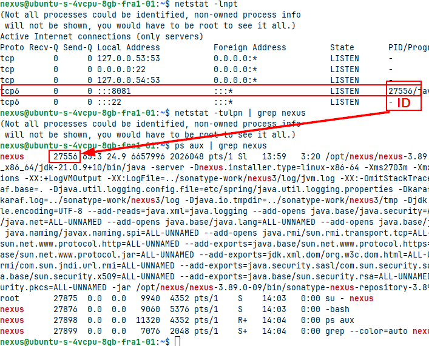

# Artifact Repository manager
**Artifact:** 
 - apps build into single file
 - formats like: jar, war, ear, zip, tar.gz, etc.

App for storing many file types.
Nexus app:
 - most popular repo manager
 - for internal use
 - proxy for external repos

MVN repository:
 - maven central rep
 - poublic

MPN repo:
 - for java projects

# Nexus
 - integrare wiht LDAP
 - rest api -> for CI/CD
 - multiformat support
 - metadata tagging
 - cleanup policies – every commit into a branch creates an artifact
 - serarch functionality across repos, projects,
 - User token for Auth

## Instaling Nexus on Digital ocean
 - https://help.sonatype.com/en/download.html
 - download nexus: `wget https://download.sonatype.com/nexus/3/nexus-3.89.0-09-linux-x86_64.tar.gz`
 - un tar (unzip) it to /opt/ directory: tar -zxvf nexus-3.89.0-09-linux-x86_64.tar.gz
   - folder: nexus-3.89.0-09 - contains runtime app itself
     - start service here. Must be created a specific user for this app.
   - folder: sonatype-work - contains own config for Nexus and data. When the nexus will ipdate it, this keep configuration data
     - contains - plugin
     - ip address of the server, etc.
     - for backup
 - Create a user 'Nexus' - for nexus app
   - change rules for this user: R - recursivly
     - `chown -R nexus:nexus sonatype-work`
     - `chown -R nexus:nexus nexus-3.89.0-09`
     - create file nexus.rc and add this line: run_as_user="nexus"
       - path: `/opt/nexus/nexus-3.89.0-09/bin# sudo nano nexus.rc` 
 - Start Nexus service:
   -  `/opt/nexus/nexus-3.89.0-09/bin/nexus start`
   -  check the service: `ps aux | grep nexus` - return process id (just on the begining)
   - check the port: `netstat -tulpn` - show on which port is running the service

### Login to Nexus UI
user: admin (default)
password: nexus
password: to get password: `/opt/nexus/sonatype-work/nexus3# cat admin.password`
url: http://167.71.57.131:8081/



## Nexus app
### Repositories
#### proxy repo
- link to the remote repo. as user i can download to my VM
 - put artifact into cache

In build pipeline i configre one endoint for this repo for all projects.
e.g.
 - maven-central - for jave
 - nuget.org-proxy - for .net

#### hosted repo
for company's private artifacts

#### group repo
for using multiple repos in application - all repos has single url


# Publish artifact to repo
Java Gradle App: https://gitlab.com/twn-devops-bootcamp/latest/06-nexus/java-app
Java Maven App: https://gitlab.com/twn-devops-bootcamp/latest/06-nexus/java-maven-app

Maven and Gradle: needs to be configured where repo is located url + credentials

## Gradle project configured with nexus.
for publication, I have to set up plugin for publishing to nexus:
 - `apply plugin: 'maven-publish'`
 - set up repo url and credentials
 - build and publish artifact
   - `gradle build`
   - `gradle publish` -  is not default in gradle, it is installed via plugin 'maven-publish'
 it does not works for maven project.

## Maven project configured with nexus.
configure settings - maybe in VM: `~/.m2/settings.xml`
then i can upload the jar file


# Nexus API
can be used: curl, wget
```bash
# curl -u <user:pwd> -X GET 'http://167.71.57.131:8081/service/rest/v1/repositories'
curl -u admin:nexus -X GET 'http://167.71.57.131:8081/service/rest/v1/repositories'
curl -u admin:nexus -X GET 'http://167.71.57.131:8081/service/rest/v1/components?repository=maven-snapshots'
```

# Nexus Blob Storage
for manage repositories.
default - is not posible to delete it.
Created blob lstore cannot be modified and cannot be deleted - because is ussually a repo.

then is possoble to attach blob store to the repo.

the blob is stored here: 
```bash
root@ubuntu-s-4vcpu-8gb-fra1-01:/opt/nexus/sonatype-work/nexus3# ls
**blobs**  clean_cache  db  downloads  etc  keystores  log  nexus.pid  restore-from-backup  tmp

root@ubuntu-s-4vcpu-8gb-fra1-01:/opt/nexus/sonatype-work/nexus3# ls blobs/
default

root@ubuntu-s-4vcpu-8gb-fra1-01:/opt/nexus/sonatype-work/nexus3/blobs/default# cd ./content
```

# Components vs Assets
**Components:**
 - is whole project

**Assets:**
 - physical file
 - 1 component can have many assets

**Docker:**
 - Docker Layers == Assets
 - 2 Docker Images ⇒ two components but share the same assets

# Polices and Cleanup
can be associated with repo

Admin -Compact blob store -> mark items for deletion

# docker Repo
it needs also create a role to enable poush docker image into store.

