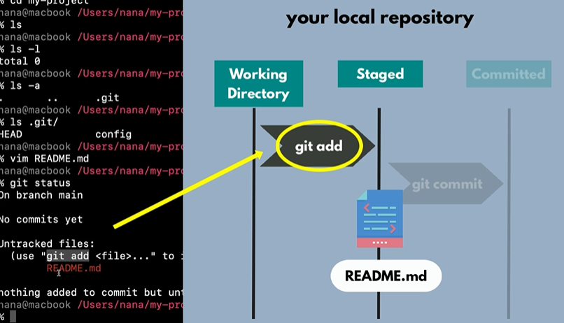
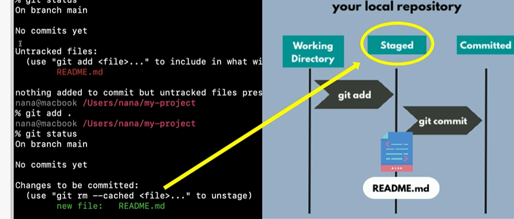
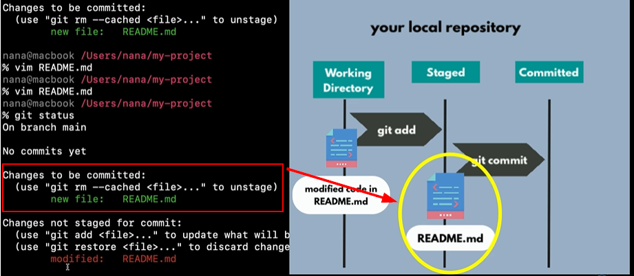

# setup git repo remote and locally

## Local repo - auth wiht poublic repo

# git

## git process
**create a new file**:  `git status`


**git add a file**: `git add filename`


**update file**:



## git commands
```bash
git add . # all files
git status
git commit
git logs
git push
git -d <branche name>
git -m "commit message"
```

## init new repo 
```bash
# 1. Initialize git in your local directory
git init

# 2. Add your files
git add .

# 3. Create initial commit
git commit -m "Initial commit"

# 4. Add the GitLab remote origin
git remote add origin https://gitlab.com/JiriMoucka1/test-node-app.git

# 5. Push to GitLab (sets upstream tracking)
git push --set-upstream origin master
```

# Trunk based development vs feature branching

Feature driven development - like Gitflov - Develop - release - main

Trunk development - short life branches.

# Branches
## Merge requests == pull request

## Rebase
Avoid merge commit in branch.
add new my commits ont the top of the branch.
pull changes from remote and stacks my changes on the top.
the changes must be in diferent files.
`git pull -r`

# .git ignore file
excludes files and folders from git.
Intelije use .idea folder. -> not in git.
build folder -> not in git.

## how to ignore folder already puch in git
it stays locally, but it is ignored in git.
```bash
git rm -r --cached .idea
git add .
git commit -m "ignore idea folder"
```

# Git stash

```bash
git stash
git stash pop               # get back changes for the last stash
git stash list
git stash clear
git stash drop stash@{0}
```
## going into history
```bash
git checkout <commit hash>
git checkout <branch name>    # switch bask to branch
```
HEAD position - means the latest commit in git.

# Undoing commits

HEAD: mark the last commit
```bash
git reset HEAD~1          # soft reset 
git reset --hard HEAD~1   # revert last commit - number say how many commits to revert
git commit --amend        # add changes to the last commint - it avoids to create a new commit

# steps to choose the commit
$ git log
commit e5e6c1bf0ac46dca2258faf397c2307e66548450 (HEAD -> feature/databse-connection)
Author: Jiri Moucka <jimo@ciklum.com>
Date:   Tue Jan 27 13:30:00 2026 +0100

    add new line  # my comment to the my commit
```

deteached HEAD state - tell me that i am not on latest state and that i can cereate new branch.


## remove commit from git
step 1. local - `git reset --hard HEAD~1`
step 2. local - `git push --force` - force remove commit from remote.

Only do it in feature branch"
Never do it in Main, Develop, Release branch.

## Revert commit in Main, Develop, Release branch
the reason is not to use reset to keep the commit in the history.
```bash
git revert <commit hash> - creates a new commit to revert the old commit's changes
```
`git reverse` removes old commit from history.

# Git for DevOps
when to use:
 - infrastructure as code
 -  continuous integration
 -  continuous delivery
