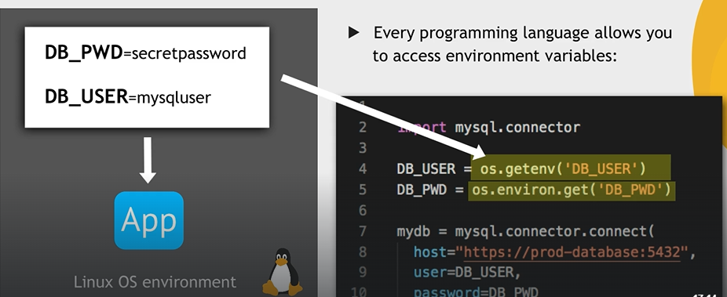

# Environment Variables
KEY - value pairs

available for whole system.

# List of the variables
```bash
printenv
printenv USER
printenv | grep USER
```

## Own variables use case
sensitive date - e.g. credentials, secret token

**Set var on the server**
every programing language has a way to read the vars.


```bash
export DB_USERNAME=dbuser-test
export DB_PASSWORD=secretpassword
export DB_NAME=testdb

printenv | grep DB
```

**delete var**
```bash
unset DB_NAME
```

When use _export DB_NAME=testdb_ live time is the same as the session of the terminal.

## Pernament variables - user specific
`nano .bashrc` - file with variables for the current user.
must be run in home directory _/home/jimo/_
then reload the the system `source .bashrc`


# System variables
`/etc/environment`
definice kde jsou binaries pro aplikace.

# add custom program