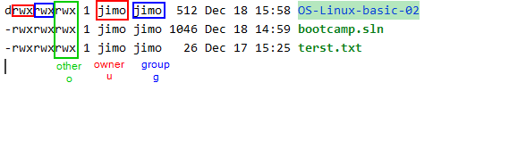

# File Overship & Permision
user permisions are related to the files

## concepts
ownership
 - user
  - group
`ls -l` - shows file with details
`chown` - change ownership

## Linux permission
every file has permissions for 3 groups - user, group, other.

**-** regular file - not executable
**d** directory
**c** character device file
**l** symbolic link
**b** block device file
**s** socket file
**p** FIFO

user = owner of a file

Another user - any another user which is not define for a file or group. has those permisions

## Symbolic permisions change
**WSL2** – it works only in home directory `cd ~`. I nanother destination it ignores the linux permision system.
### remove permison
use **-**
`sudo chmod -x filename.txt` - change mode, remove -x permision
`sudo chmod g-x filename.txt` - remove group permision
    - for _other_ use **o**
    - for all use **a**

### add permision
use **+**
`sudo chmod +x filename.txt` - change mode,

## multi permissions change for owner
I can whole permision block at once
`sudo schmod g=rwx filename.txt`

# numeric permision
replace char definition of the permision

| number | permission type   | Symbol |
|--------|-------------------|--------|
| 0      | no permission     | –      |
| 1      | execute           | --x    |
| 2      | write             | -w-    |
| 3      | write and execute | -wx    |
| 4      | read              | r--    |
| 5      | read and execute  | r-x    |
| 6      | read and write    | rw-    |
| 7      | all permissions   | rwx    |

`sudo chmod 777 filename.txt`