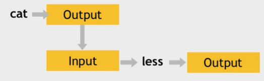

# Pipes `|` and redirects

Every command has input and output.
So I can use _cat_ command and its output and use it as input for another command like _less_.

## Piping
to pass content from one command to another is via pipe `|`.
`cat /var/log/syslog | less`
    - **less** is viewer page per page.

### Grep
`history | grep sudo` - show all commands that contains sudo.
`history | grep "sudo chmod"` - "" becouse of the more words.

## Redirecting
to save output of command to file I use `>` operator.
`history | grep sudo > sudo-commands.txt`
    - > revriting lines
    - >> appending lines

# Standard Input and Output
Every program has 3 built-in streams:
- standard input (stdin)
- standard output (stdout)
- standard error (stderr)

# Semicolon **;**
I can write more commands in one line separated by semicolon.
`clear; sleep 1; echo "hello"`