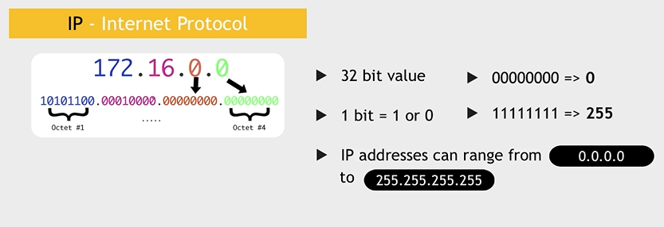
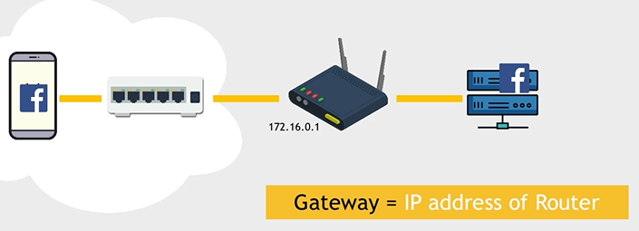
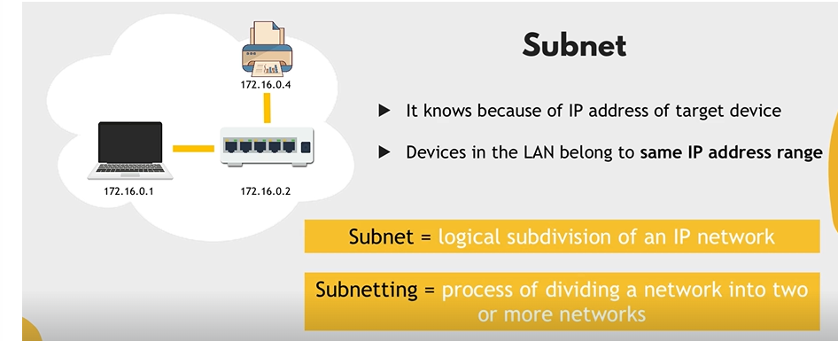

# networking
every VM needs IP, Subnet, Gateway (router)

# LAN - local area network
 - uniq IP
 - e.g. home network

## IP 
- 32 bit


## Switch
know all devices from LAN

## Router
sits between LAN and WAN and connects to the internet.

Gateway - IP address of router

## Subnet
It devide a network into two or more netwrotks.
is device in outside or in inside of LAN?
Octet. 
Dictate how many bits are fices.
192.168.0.0/24 -. 24 bits are fixed.



### Subnet mask
set 

## NAT

## Firewall
prevents to unauthorized access.
which IP can access.
which IP can be available.

## Port
Like door to the same building.
each port is uniq on the device.

## DNS
domain name Service
translate name into IP.

every pc has DN server preinstalled.

## Networking commands
```bash
ifconfig
netstat
ps aux # which app and services are running
nslookup   
ping
```


# WAN - wide area network
ICANN - manage domain names.

