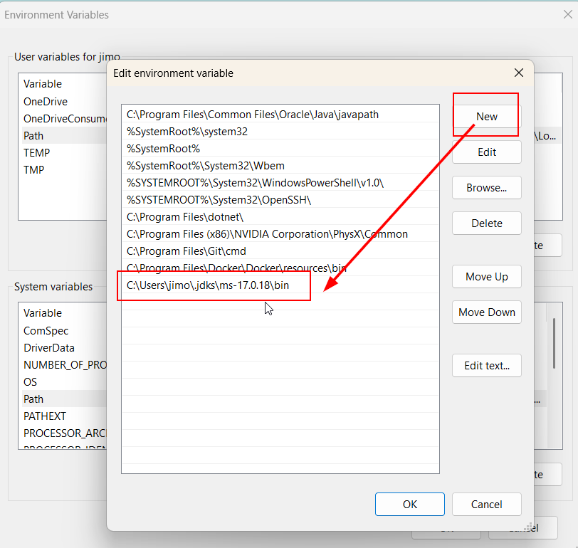
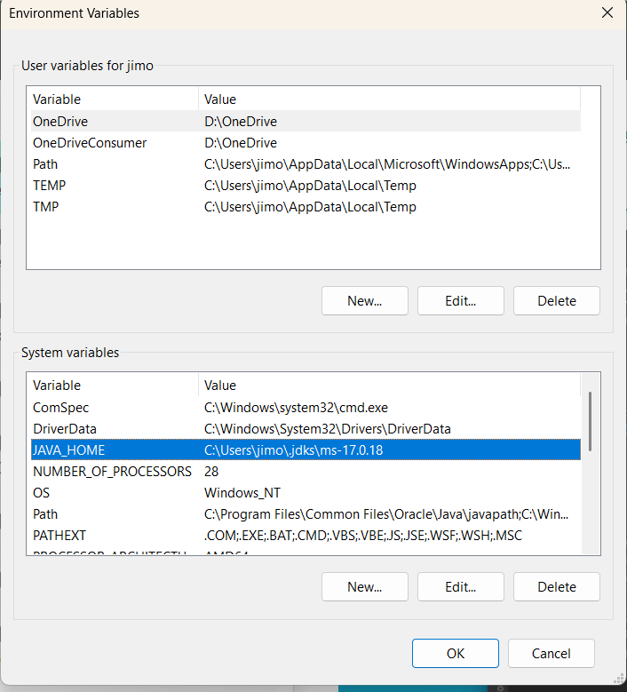

# Introduction

# Build and package manager tool

Artifact repository – store for built artifacts.

file types:
 depend on the programming language and build tool used.
- jar - Java archive
- war

# tools need to isnstall
## Java
to run java in terminal, I have to specify executable path. 
```bash
C:\Users\jimo\.jdks\ms-17.0.18\bin\java --version
```

how to fox it:
to add java executable path into Envionments variable:

Then restart terminal and then i can run java command directly in the terminal.

```bash
echo %PATH% # print the environments
```
### JAVA_HOME environment variable


## Maven
:build tool for Java
to download: https://maven.apache.org/download.cgi?.
no i can add it into global environment variable.

commands:
```bash
mvn package # build project
```

npm - must be in the same directory where app is executed.

## node
`npm install` - intall all dependencies

then command `node server`

# Local coopy of the dependecies 
is important to avoid dowloading the same dependecies again and again.

# Run app
`java -jar`

# Package FE code
zip or tar file. 
 - app code not dependencies.
 - you must intall dependencies and then build the app.
Alternative is npm or yarn file.
package.json file for dependencies.

`^ - latest version`
.bundle.js - compres file for web browssers.

WAR file - package everything into one file (FE+BE)

# Python
PIP - package manager for python.

# Build tool
 - dependency file
 - repo for dependencies
 - command line tool
 - package managers

# publishing artifacts


# Build tools and docker
Docker image is 1 artifact
 -> no need for a repo for each file type.
 -> docker is alternative for all other artifacts types.
 -> execute everything in docker container.

# Build tools for DevOps
Developers use those tools locally.
Devops - building is going on the build machine.
